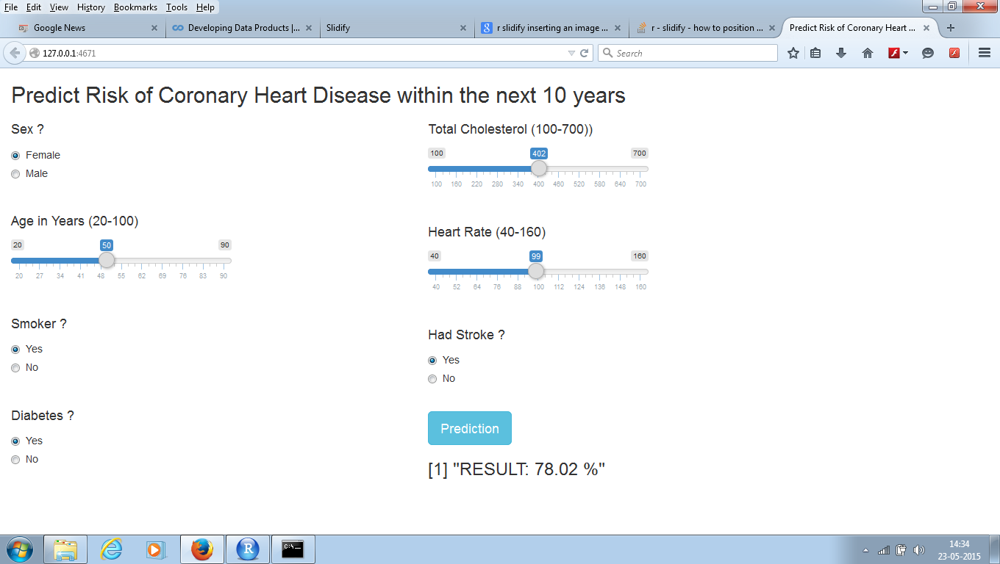
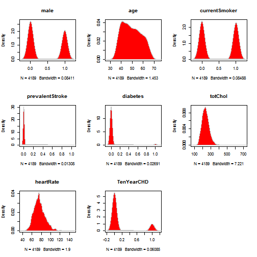

## Introduction

1. Application enables to calculate prediction results (in percentage) for the 'Risk in Coronary Heart Disease in the coming 10 years' for user provided inputs.

2. Provides a GUI for input data.

3. Uses the Generalized Linear Regression to build the Predictive Model from a subset of the original "Framingham Coronary Heart Disease dataset". Details of Framingham Coronary Heart Disease may be obtained from this link --> https://www.framinghamheartstudy.org/ 

4. The application hosted on Shiny Server has a GUI enabling reactive components (ie. automatic updating of results for user changed inputs).

--- .class #id

## Snapshot of Application in Shiny Server


<div style='text-align: center;'>
    
</div>

---


## DataSet


The Training dataset is a subset of the "framingham coronary heart dataset". 
The Generalized Linear Model is built using the response variable "TenYearCHD". 
Only 7 out of the original 15 variables have been taken as the predictive variables.

Below is shown details of the dataset used for building the predictive Model


```
## 'data.frame':	4189 obs. of  8 variables:
##  $ male           : int  1 0 1 0 0 0 0 0 1 1 ...
##  $ age            : int  39 46 48 61 46 43 63 45 52 43 ...
##  $ currentSmoker  : int  0 0 1 1 1 0 0 1 0 1 ...
##  $ prevalentStroke: int  0 0 0 0 0 0 0 0 0 0 ...
##  $ diabetes       : int  0 0 0 0 0 0 0 0 0 0 ...
##  $ totChol        : int  195 250 245 225 285 228 205 313 260 225 ...
##  $ heartRate      : int  80 95 75 65 85 77 60 79 76 93 ...
##  $ TenYearCHD     : int  0 0 0 1 0 0 1 0 0 0 ...
```

--- 

## DataSet- Variable Density Plot


```
## Loading required package: ggplot2
```

 

---

##  Generalised Linear Model


```
## 
## Call:
## glm(formula = TenYearCHD ~ ., family = "binomial", data = chd)
## 
## Deviance Residuals: 
##     Min       1Q   Median       3Q      Max  
## -1.3689  -0.6111  -0.4490  -0.3177   2.6185  
## 
## Coefficients:
##                  Estimate Std. Error z value Pr(>|z|)    
## (Intercept)     -7.440874   0.474993 -15.665  < 2e-16 ***
## male             0.546712   0.094446   5.789 7.10e-09 ***
## age              0.078811   0.005704  13.816  < 2e-16 ***
## currentSmoker    0.343716   0.096046   3.579 0.000345 ***
## prevalentStroke  1.247537   0.429955   2.902 0.003713 ** 
## diabetes         0.852422   0.215063   3.964 7.38e-05 ***
## totChol          0.002690   0.001010   2.664 0.007732 ** 
## heartRate        0.007026   0.003734   1.881 0.059925 .  
## ---
## Signif. codes:  0 '***' 0.001 '**' 0.01 '*' 0.05 '.' 0.1 ' ' 1
## 
## (Dispersion parameter for binomial family taken to be 1)
## 
##     Null deviance: 3561.0  on 4188  degrees of freedom
## Residual deviance: 3250.6  on 4181  degrees of freedom
## AIC: 3266.6
## 
## Number of Fisher Scoring iterations: 5
```

---

## Thank You


Application at https://ranjit.shinyapps.io/ShinyApp/ 


Thanks for Viewing
